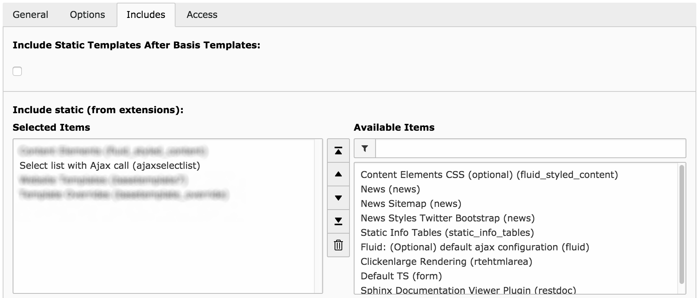

.. ==================================================
.. FOR YOUR INFORMATION
.. --------------------------------------------------
.. -*- coding: utf-8 -*- with BOM.

.. include:: ../Includes.txt

.. _admin-manual:

Administrator Manual
====================

.. _admin-installation:

Installation
------------

To install the extension, perform the following steps:

#. Go to the Extension Manager
#. Load and install the extension
#. Include the static template *Select list with Ajax call (ajaxselectlist)* into your TypoScript template
#. Add permissions for the plugin and records for your editors

.. attention::

	The Ajax request that loads the records depends on **jQuery**. You have to include jQuery in your website if not already done. This extension does not implement jQuery for you.

	If you know JavaScript you can just use *XMLHttpRequest()* and ignore jQuery. The JavaScript is part of the *List.html* template.

.. figure:: ../Images/AdministratorManual/ExtensionManager.png
	:alt: ajaxselectlist in the Extension Manager

	*ajaxselectlist* in the Extension Manager

	Include the static template

.. _admin-configuration:

Configuration
-------------

After completing the above steps, the plugin and records can be created.
The plugin will already load your records in the frontend.

However, you'll want to modify the Fluid templates to fit your design and needs.
The :ref:`configuration` covers TypoScript settings and :ref:`configuration-templates`.

.. _admin-subpages:

.. warning::

	Breaking: When updating from a former version of ajaxselectlist, you'll have to adapt your customized template!
	You now must use a for-Viewhelper to iterate through the various media files.
	Don't forget to use the name inside the as-attribute in your inner variables.
	See :ref:`administrator-upgrade` for more information.

Subpages
--------

.. toctree::
	:maxdepth: 5
	:titlesonly:

	Upgrade/Index
	Lightbox/Index
	RealURL/Index