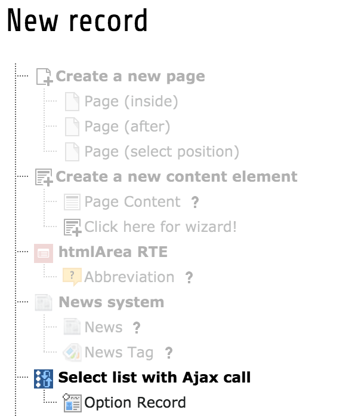
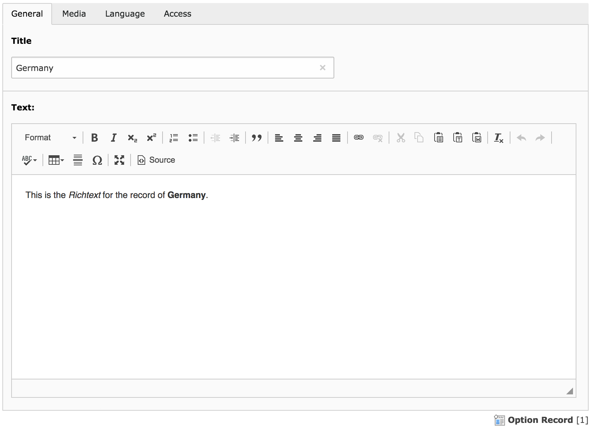
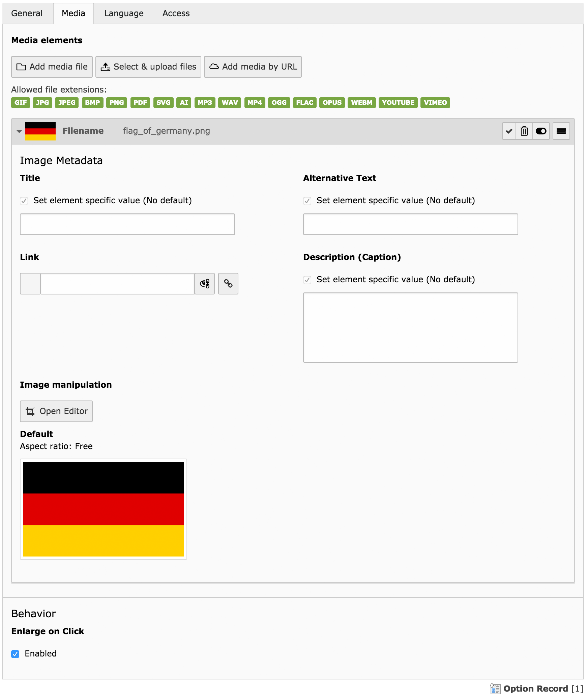
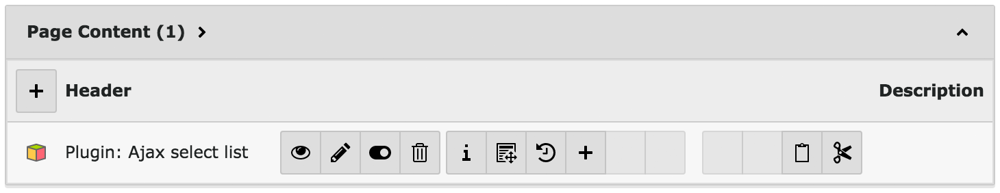
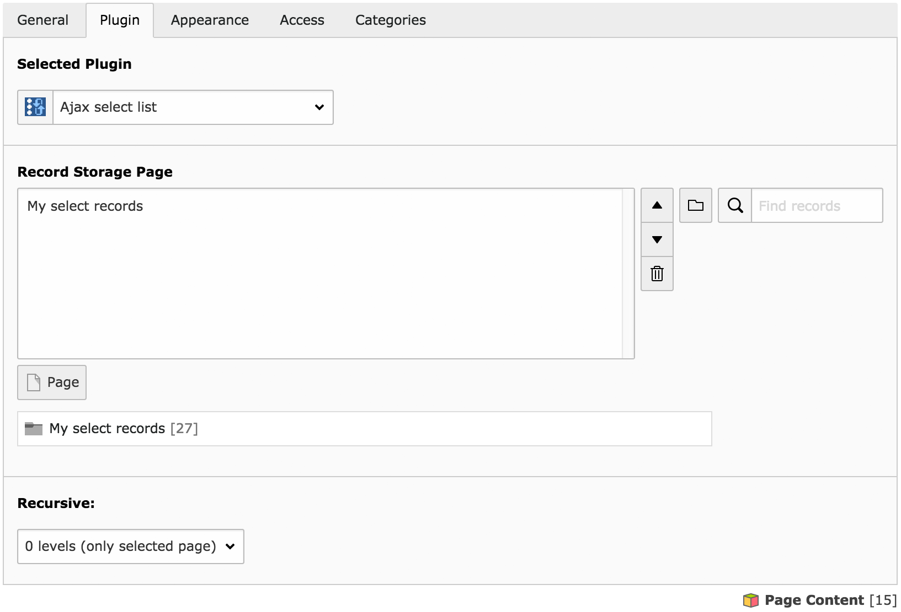
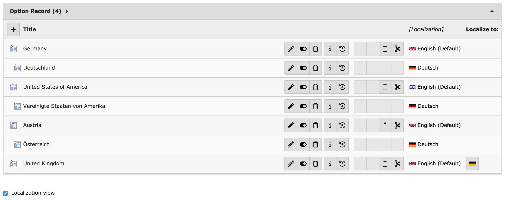

.. ==================================================
.. FOR YOUR INFORMATION
.. --------------------------------------------------
.. -*- coding: utf-8 -*- with BOM.

.. include:: ../Includes.txt

.. _user-manual:

Users Manual
============

#. Create some records (in a separate folder or a normal page)
#. Insert the plugin on a page
#. Choose the location of the records
#. Translate your records (optional)

1. Create some records
----------------------

Create some records to show on your website. You could save them on the same page as the plugin or in a separate folder.

Please remember: records for this extension are editable only in the *Web>List* view.

   Add a new option record

   Backend form for the records. General tab with Title field and Rich Text Editor.

   Backend form for the records. Media tab with related media file and the button for cropping the image.

2. Insert the plugin on a page
------------------------------

Create a **new content element** and switch it to *Insert Plugin*. In the tab *Plugin*, select **Ajax select list**.

   List view of the plugin

3. Choose the location of the records
-------------------------------------

In the field *Record Storage Page*, choose the folder or page which contains the desired records. You can choose more than one page.

If the records are in sub-folders or pages, you can set a recursive level in the select list below.

   Backend form for the plugin

4. Translate your records (optional)
------------------------------------

If you're working on a multilanguage page, you can start translating your records now.

.. Important ::

   In order to translate records, you have to activate the checkbox *Localization view* in the *Web>List* view. It is also important that there is an *Alternative Page Language* set on the page/folder that contains the records and/or plugin. If you're not allowed to create  Alternative Page Languages, contact an administrator and request assistance.

If the above conditions are met, your TYPO3 backend shows flag buttons next to your records. Click on any of them to translate the record to the chosen language.

The **plugin** itself has to be translated, too. You don't have to change anything in the plugin's settings, though. TYPO3 selects the translated records for you.

   List view of the option records including translations. The last record ("United Kingdom") is not yet translated, the flag button is shown to create a translation.

